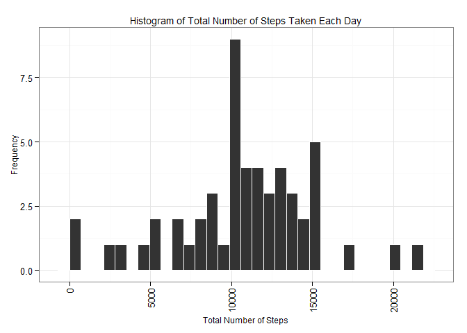
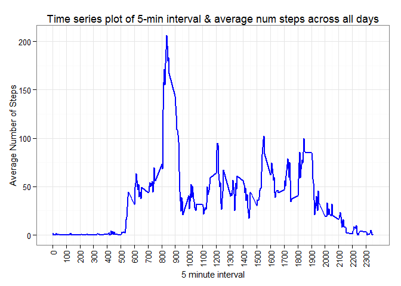
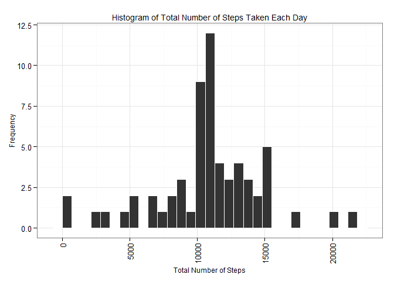
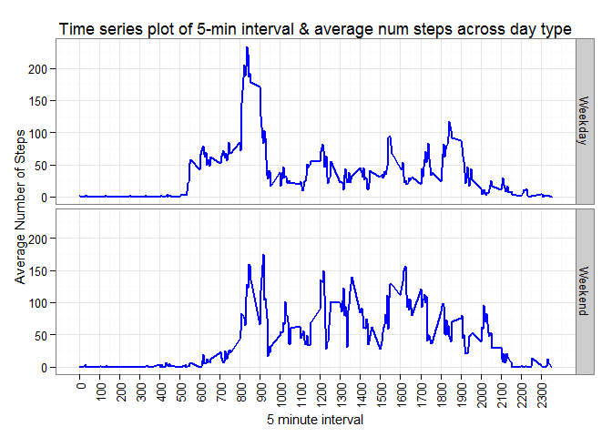

# Reproducible Research - Peer Assessment 1

## Loading and preprocessing the data


```r
library(ggplot2)
library(pander)

# read the csv file
AC <- read.csv("Activity.csv")

# calculate the total steps per day
AC.sum <- aggregate(formula=steps~date, data=AC, FUN=sum, na.action = na.omit)
colnames(AC.sum)[colnames(AC.sum)=="steps"] <- "Total.Steps"

## calculate the mean steps per day
AC.mean <- aggregate(formula=steps~date, data=AC, FUN=mean, na.action = na.omit)
colnames(AC.mean)[colnames(AC.mean)=="steps"] <- "Mean.Steps"

# calculate the medians steps per day
AC.median <- aggregate(formula=steps~date, data=AC, FUN=median, na.action = na.omit)
colnames(AC.median)[colnames(AC.median)=="steps"] <- "Median.Steps"

# merge Total, Mean, Median tables together
AC.all <- merge(AC.sum, AC.mean, by="date", all=TRUE)
AC.all <- merge(AC.all, AC.median, by="date", all=TRUE)

# calculate the mean of 5 min interval across all days.
AC.5min <- aggregate(formula=steps~interval, data=AC, FUN=mean, na.action = na.omit)
colnames(AC.5min)[colnames(AC.5min)=="steps"] <- "mean.5min.steps"
```

## Total, Mean, and Median number of steps taken per day


```r
# print table
pandoc.table(AC.all, justify = "left", split.tables = Inf)
```


----------------------------------------------------
date       Total.Steps   Mean.Steps   Median.Steps  
---------- ------------- ------------ --------------
2012-10-02 126           0.4375       0             

2012-10-03 11352         39.42        0             

2012-10-04 12116         42.07        0             

2012-10-05 13294         46.16        0             

2012-10-06 15420         53.54        0             

2012-10-07 11015         38.25        0             

2012-10-09 12811         44.48        0             

2012-10-10 9900          34.38        0             

2012-10-11 10304         35.78        0             

2012-10-12 17382         60.35        0             

2012-10-13 12426         43.15        0             

2012-10-14 15098         52.42        0             

2012-10-15 10139         35.2         0             

2012-10-16 15084         52.38        0             

2012-10-17 13452         46.71        0             

2012-10-18 10056         34.92        0             

2012-10-19 11829         41.07        0             

2012-10-20 10395         36.09        0             

2012-10-21 8821          30.63        0             

2012-10-22 13460         46.74        0             

2012-10-23 8918          30.97        0             

2012-10-24 8355          29.01        0             

2012-10-25 2492          8.653        0             

2012-10-26 6778          23.53        0             

2012-10-27 10119         35.14        0             

2012-10-28 11458         39.78        0             

2012-10-29 5018          17.42        0             

2012-10-30 9819          34.09        0             

2012-10-31 15414         53.52        0             

2012-11-02 10600         36.81        0             

2012-11-03 10571         36.7         0             

2012-11-05 10439         36.25        0             

2012-11-06 8334          28.94        0             

2012-11-07 12883         44.73        0             

2012-11-08 3219          11.18        0             

2012-11-11 12608         43.78        0             

2012-11-12 10765         37.38        0             

2012-11-13 7336          25.47        0             

2012-11-15 41            0.1424       0             

2012-11-16 5441          18.89        0             

2012-11-17 14339         49.79        0             

2012-11-18 15110         52.47        0             

2012-11-19 8841          30.7         0             

2012-11-20 4472          15.53        0             

2012-11-21 12787         44.4         0             

2012-11-22 20427         70.93        0             

2012-11-23 21194         73.59        0             

2012-11-24 14478         50.27        0             

2012-11-25 11834         41.09        0             

2012-11-26 11162         38.76        0             

2012-11-27 13646         47.38        0             

2012-11-28 10183         35.36        0             

2012-11-29 7047          24.47        0             
----------------------------------------------------

## Histogram of Total Number of Steps Taken Each Day


```r
# create a histogram per day
g <- ggplot(AC.sum, aes(AC.sum$Total.Steps))
g <- g + geom_histogram(color="white")
g <- g + ggtitle("Histogram of Total Number of Steps Taken Each Day") 
g <- g + xlab("Total Number of Steps") + ylab("Frequency")
g <- g + theme_bw()
g <- g +  theme(axis.text.x=element_text(angle=90,hjust=1,vjust=0.5), title=element_text(size=9))
print(g)
```

 

```r
rm(g) 
```

#Line Chart of average daily activity pattern per 5 min interval
Time Series plot (i.e. type = "l") of the 5-minute interval (x-axis) and the average number of steps taken, averaged across all days (y-axis)

```r
# plot Cumulative Count per day
g <- ggplot(AC.5min, aes(AC.5min$interval, AC.5min$mean.5min.steps)) 
g <- g + geom_line(color="blue", linetype=1, size=1) 
g <- g + ggtitle("Time series plot of 5-min interval & average num steps across all days") 
g <- g + xlab("5 minute interval") 
g <- g + ylab("Average Number of Steps")
g <- g + theme_bw()
g <- g + scale_x_continuous(breaks = round(seq(min(AC.5min$interval), max(AC.5min$interval), by = 100),1))
g <- g +  theme(axis.text.x=element_text(angle=90,hjust=1,vjust=0.5), title=element_text(size=11)) # vertical x aXIS TEXT
print(g)
```

 

# Max Steps in 5 min interval
Which 5-minute interval, on average across all the days in the dataset, contains the maximum number of steps?

```r
max.5min <- max(AC.5min$mean.5min.steps)
print(max.5min)
```

[1] 206.1698

# Imputing missing values
1.Calculate and report the total number of missing values in the dataset (i.e. the total number of rows with NAs)


```r
AC.steps.na <- subset(AC, is.na(steps) )
AC.date.na <- subset(AC, is.na(date) )
AC.interval.na <- subset(AC, is.na(interval) )
AC.anyrow.na <- subset(AC, is.na(steps) | is.na(date) | is.na(interval))
missing.values <- data.frame(Total.number.of.rows=nrow(AC),
                            Missing.steps.values=nrow(AC.steps.na),
                            Missing.date.values=nrow(AC.date.na),
                            Missing.interval.values=nrow(AC.interval.na),
                            Rows.with.missing.values=nrow(AC.anyrow.na)
                            )
# print table
pandoc.table(t(missing.values), justify = "left", split.tables = Inf)
```


------------------------------ -----
**Total.number.of.rows**       17568

**Missing.steps.values**       2304 

**Missing.date.values**        0    

**Missing.interval.values**    0    

**Rows.with.missing.values**   2304 
------------------------------ -----

```r
rm(missing.values)
```

# Imputing missing values
2.Strategy for filling in all of the missing values in the dataset. 

My strategy: replace the NAs in the dataset with the mean of the 5 min interval across all days.


```r
# merge the mean for 5min interval columns with the main data set
AC.clean <- merge(AC, AC.5min, by="interval", all=TRUE)
AC.clean$steps[is.na(AC.clean$steps)] <- AC.clean$mean.5min.steps[is.na(AC.clean$steps)]

# print again to make sure that no NAs are left in the data set
AC.clean.steps.na <- subset(AC.clean, is.na(steps) )
AC.clean.date.na <- subset(AC.clean, is.na(date) )
AC.clean.interval.na <- subset(AC.clean, is.na(interval) )
AC.clean.anyrow.na <- subset(AC.clean, is.na(steps) | is.na(date) | is.na(interval))
missing.values <- data.frame(Total.number.of.rows=nrow(AC.clean),
                            Missing.steps.values=nrow(AC.clean.steps.na),
                            Missing.date.values=nrow(AC.clean.date.na),
                            Missing.interval.values=nrow(AC.clean.interval.na),
                            Rows.with.missing.values=nrow(AC.clean.anyrow.na)
                            )
# print table
pandoc.table(t(missing.values), justify = "left", split.tables = Inf)
```


------------------------------ -----
**Total.number.of.rows**       17568

**Missing.steps.values**       0    

**Missing.date.values**        0    

**Missing.interval.values**    0    

**Rows.with.missing.values**   0    
------------------------------ -----

## Total, Mean, and Median number of steps taken per day for the CLEAN data set compared to the ORIGINAL data set
Notice that the clean data set does not have any NAs, and that the NA values in the original data set are now replaced with actual values in the clean data set.


```r
# calculate the total steps per day
AC.clean.sum <- aggregate(formula=steps~date, data=AC.clean, FUN=sum, na.action = na.omit)
colnames(AC.clean.sum)[colnames(AC.clean.sum)=="steps"] <- "clean.Total.Steps"

## calculate the mean steps per day
AC.clean.mean <- aggregate(formula=steps~date, data=AC.clean, FUN=mean, na.action = na.omit)
colnames(AC.clean.mean)[colnames(AC.clean.mean)=="steps"] <- "clean.Mean.Steps"

# calculate the medians steps per day
AC.clean.median <- aggregate(formula=steps~date, data=AC.clean, FUN=median, na.action = na.omit)
colnames(AC.clean.median)[colnames(AC.clean.median)=="steps"] <- "clean.Median.Steps"

# merge Total, Mean, Median tables together
AC.clean.all <- merge(AC.clean.sum, AC.clean.mean, by="date", all=TRUE)
AC.clean.all <- merge(AC.clean.all, AC.clean.median, by="date", all=TRUE)

# merge with original data set to show the difference
AC.clean.all <- merge(AC.clean.all, AC.all, by=c("date"), all=TRUE)

# print the table to compare clean vs. original ordering the columns to have totals/mean/median next to each other.
pandoc.table(AC.clean.all[,c(1,2,5,3,6,4,7)], justify = "left", split.tables = Inf)
```


----------------------------------------------------------------------------------------------------------------
date       clean.Total.Steps   Total.Steps   clean.Mean.Steps   Mean.Steps   clean.Median.Steps   Median.Steps  
---------- ------------------- ------------- ------------------ ------------ -------------------- --------------
2012-10-01 10766               NA            37.38              NA           34.11                NA            

2012-10-02 126                 126           0.4375             0.4375       0                    0             

2012-10-03 11352               11352         39.42              39.42        0                    0             

2012-10-04 12116               12116         42.07              42.07        0                    0             

2012-10-05 13294               13294         46.16              46.16        0                    0             

2012-10-06 15420               15420         53.54              53.54        0                    0             

2012-10-07 11015               11015         38.25              38.25        0                    0             

2012-10-08 10766               NA            37.38              NA           34.11                NA            

2012-10-09 12811               12811         44.48              44.48        0                    0             

2012-10-10 9900                9900          34.38              34.38        0                    0             

2012-10-11 10304               10304         35.78              35.78        0                    0             

2012-10-12 17382               17382         60.35              60.35        0                    0             

2012-10-13 12426               12426         43.15              43.15        0                    0             

2012-10-14 15098               15098         52.42              52.42        0                    0             

2012-10-15 10139               10139         35.2               35.2         0                    0             

2012-10-16 15084               15084         52.38              52.38        0                    0             

2012-10-17 13452               13452         46.71              46.71        0                    0             

2012-10-18 10056               10056         34.92              34.92        0                    0             

2012-10-19 11829               11829         41.07              41.07        0                    0             

2012-10-20 10395               10395         36.09              36.09        0                    0             

2012-10-21 8821                8821          30.63              30.63        0                    0             

2012-10-22 13460               13460         46.74              46.74        0                    0             

2012-10-23 8918                8918          30.97              30.97        0                    0             

2012-10-24 8355                8355          29.01              29.01        0                    0             

2012-10-25 2492                2492          8.653              8.653        0                    0             

2012-10-26 6778                6778          23.53              23.53        0                    0             

2012-10-27 10119               10119         35.14              35.14        0                    0             

2012-10-28 11458               11458         39.78              39.78        0                    0             

2012-10-29 5018                5018          17.42              17.42        0                    0             

2012-10-30 9819                9819          34.09              34.09        0                    0             

2012-10-31 15414               15414         53.52              53.52        0                    0             

2012-11-01 10766               NA            37.38              NA           34.11                NA            

2012-11-02 10600               10600         36.81              36.81        0                    0             

2012-11-03 10571               10571         36.7               36.7         0                    0             

2012-11-04 10766               NA            37.38              NA           34.11                NA            

2012-11-05 10439               10439         36.25              36.25        0                    0             

2012-11-06 8334                8334          28.94              28.94        0                    0             

2012-11-07 12883               12883         44.73              44.73        0                    0             

2012-11-08 3219                3219          11.18              11.18        0                    0             

2012-11-09 10766               NA            37.38              NA           34.11                NA            

2012-11-10 10766               NA            37.38              NA           34.11                NA            

2012-11-11 12608               12608         43.78              43.78        0                    0             

2012-11-12 10765               10765         37.38              37.38        0                    0             

2012-11-13 7336                7336          25.47              25.47        0                    0             

2012-11-14 10766               NA            37.38              NA           34.11                NA            

2012-11-15 41                  41            0.1424             0.1424       0                    0             

2012-11-16 5441                5441          18.89              18.89        0                    0             

2012-11-17 14339               14339         49.79              49.79        0                    0             

2012-11-18 15110               15110         52.47              52.47        0                    0             

2012-11-19 8841                8841          30.7               30.7         0                    0             

2012-11-20 4472                4472          15.53              15.53        0                    0             

2012-11-21 12787               12787         44.4               44.4         0                    0             

2012-11-22 20427               20427         70.93              70.93        0                    0             

2012-11-23 21194               21194         73.59              73.59        0                    0             

2012-11-24 14478               14478         50.27              50.27        0                    0             

2012-11-25 11834               11834         41.09              41.09        0                    0             

2012-11-26 11162               11162         38.76              38.76        0                    0             

2012-11-27 13646               13646         47.38              47.38        0                    0             

2012-11-28 10183               10183         35.36              35.36        0                    0             

2012-11-29 7047                7047          24.47              24.47        0                    0             

2012-11-30 10766               NA            37.38              NA           34.11                NA            
----------------------------------------------------------------------------------------------------------------

## Histogram of Total Number of Steps Taken Each Day for the CLEAN data set


```r
# create a histogram per day
g <- ggplot(AC.clean.sum, aes(AC.clean.sum$clean.Total.Steps))
g <- g + geom_histogram(color="white")
g <- g + ggtitle("Histogram of Total Number of Steps Taken Each Day") 
g <- g + xlab("Total Number of Steps") + ylab("Frequency")
g <- g + theme_bw()
g <- g +  theme(axis.text.x=element_text(angle=90,hjust=1,vjust=0.5), title=element_text(size=9))
print(g)
```

 

```r
rm(g) 
```

## Are there differences in activity patterns between weekdays and weekends?


```r
# add the weekday or weekend flag
AC$day <- weekdays(as.Date(AC$date))
AC$dayType <- ifelse(AC$day=="Saturday" | AC$day=="Sunday", "Weekend", "Weekday")
AC$dayType <- as.factor(AC$dayType)

# calculate average steps for weekday and weeekend for each 5 min interval
AC.dayType <- aggregate(formula=steps~interval+dayType, data=AC, FUN=mean)
```

# Plot 5 min interval for Weekdays and Weekends


```r
# plot Cumulative Count per day
g <- ggplot(AC.dayType, aes(AC.dayType$interval, AC.dayType$steps)) 
g <- g + geom_line(color="blue", linetype=1, size=1) 
g <- g + facet_grid( dayType~.)
g <- g + ggtitle("Time series plot of 5-min interval & average num steps across day type") 
g <- g + xlab("5 minute interval") 
g <- g + ylab("Average Number of Steps")
g <- g + theme_bw()
g <- g + scale_x_continuous(breaks = round(seq(min(AC.5min$interval), max(AC.5min$interval), by = 100),1))
g <- g +  theme(axis.text.x=element_text(angle=90,hjust=1,vjust=0.5), title=element_text(size=11)) # vertical x aXIS TEXT
print(g)
```

 
